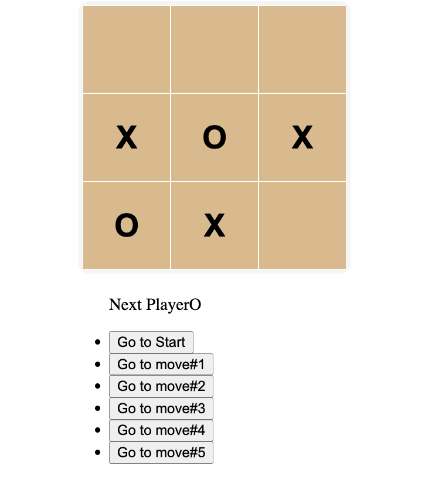

## React Tic tac toe game
A React based Tic tac toe game built with **React**.

A classic Tic-Tac-Toe game built with **React**, featuring move history navigation and a clean, responsive interface.

This project was created to practice **state management**, **component architecture**, and **game logic implementation** in React.

[ Let's Try in Live :)](https://gmarav05.github.io/react-tic-tac-toe/)

## Image



## How to Play

1. Players take turns clicking on empty squares.

2. X always goes first.

3. The first player to get 3 marks in a row (horizontally, vertically, or diagonally) wins.

4. If all 9 squares are filled and no player has won, the game is a draw.

5. Use the history buttons to go to previous moves or restart the game.

## Features

- **Interactive Gameplay**: Click on squares to make moves alternating between X and O.

- **Move History**: Navigate through the game history with "Go to move #X" buttons.

- **Game Reset**: Start a fresh game anytime with the "Go to Start" button.

- **Winner Detection**: Automatically detects and announces the winner.

- **Responsive Design**: Clean, minimalist UI that works on all devices.

- **Built with Modern Tools**: React 19 and Vite for fast development.

## Learnings

- Implemented game state management with React hooks.

- Practiced lifting state up to share data between components.

- Built reusable component architecture (Game → Board → Square).

- Implemented move history with time-travel functionality.

- Applied winner detection algorithm for Tic-Tac-Toe.

- Learned Vite configuration for GitHub Pages deployment.

## Live demo

[ View Live  :)](https://gmarav05.github.io/react-tic-tac-toe/)


## Technology Stack

**Frontend**: React 19.

**Build Tool**: Vite.

**Styling**: CSS3.

**Deployment**: GitHub Pages.


## Project Structure

```
react-tic-tac-toe/
├── node_modules/           # Installed dependencies
├── public/                 # Static assets
├── src/
│   ├── components/
│   │   ├── Board.jsx       # Game board component
│   │   ├── Game.jsx        # Main game logic component
│   │   └── Square.jsx      # Individual square component
│   ├── App.jsx             # Root component
│   ├── helpers.js          # Game logic utilities
│   ├── index.css           # Global styles
│   └── main.jsx            # Entry point
├── .gitignore              # Git ignore rules
├── eslint.config.js        # ESLint configuration
├── index.html              # HTML template
├── package.json            # Dependencies & scripts
├── package-lock.json       # Locked dependency versions
├── README.md               # Project documentation
└── vite.config.js          # Vite configuration
```

## Getting Started

### Prerequisites

- Node.js (v16 or higher)
- npm or yarn package manager

## Installation

### Clone the repository
   ```bash
   git clone https://github.com/gmarav05/react-tic-tac-toe.git
   cd react-tic-tac-toe
   ```

### Install dependencies

```sh
npm install
```

### Run locally

```sh
npm run dev
```

### Build for production

```sh
npm run build
```

### Deploy to GitHub Pages

```sh
npm run deploy
```
---

 